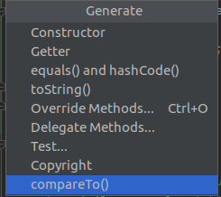
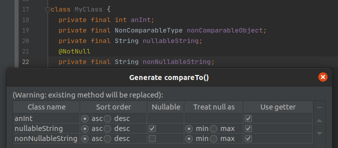

## generateCompareTo
#### An IntelliJ IDEA plugin for automatically generating a compareTo method for classes
Based on [a plugin](https://github.com/jhartman/generateCompareTo) by Joshua Hartman and improved.
___
Adds a new `Generate -> compareTo()` action to the class context menu that either generates a new `compareTo()` method or replaces an existing one.

The order it induces is a lexicographic order based on non-static fields of our class that are of comparable types, i.e. either primitive or which themselves implement the interface `Comparable`.

In the following dialog, you can customize the behaviour:
* Select the fields that you want to be used, and in which sequence.
* For each of them, you can specify whether you want this field to be compared in ascending or descending order. 
* Additionally, for each field of a non-primitive type, you can specify whether it's nullable -- in that case, `null` will be treated as the least value of that type. The default behaviour is deduced from the presence or absence of `@NotNull`/`@NonNull` annotations.

